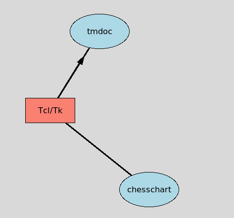

# chesschart 0.2 
    
### Dr. Detlef Groth, Schwielowsee, Germany
    
### 2020-12-03

## <a>NAME</a>

**chesschart**  - Tk widget based on canvas to create flow charts using natural 
                   coordinate systems like the chessboard coordinate system.

## <a name='toc'>TABLE OF CONTENTS</a>

 - [SYNOPSIS](#synopsis)
 - [DESCRIPTION](#description)
 - [COMMAND](#command)
 - [WIDGET OPTIONS](#options)
 - [WIDGET COMMANDS](#commands)
     - [arrow](#arrow) 
     - [background](#background)
     - [figure](#figure)
     - [line](#line)
     - [mv](#mv)
     - [oval](#oval)
     - [rect](#rect)
     - [spline](#spline)
     - [text](#text)
 - [EXAMPLE](#example)
 - [CHANGES](#changes)
 - [TODO](#todo)
 - [AUTHOR](#authors)
 - [LICENSE AND COPYRIGHT](#license)

## <a name='synopsis'>SYNOPSIS</a>

    package require chesschart
    chesschart pathName ?canvasoptions chesschartoption?

## <a name='description'>DESCRIPTION</a>

**chesschart** - is a flowchart widget based on the standard Tk canvas. Items like rectangles, ovals, 
circles, text, arrow, lines can be placed on the widget using an easy to remember coordiate system
such as chess coordinates. As the **chesschart** widget is based on the Tk canvas widget, all options 
and methods of the widget are support. See below for additional options and methods.

## <a name='command'>COMMAND</a>

**chesschart** *pathName ?canvas options chesschart options?*

> Creates and configures a new **chesschart** widget  using the Tk window id _pathName_ and the given *options*. 
 
## <a name='options'>WIDGET OPTIONS</a>

  __-bg__ _color_ 

 > Default background for the canvas widget, here changed to white.

  __-color__ _color_ 

 > Default color for oval and rect items, default: salmon

  __-columns__ _colnames_ 

 > Default column names for the coordinate system, starting from left to 
   right, default: letters [list A B C D E F G H], which mimic a chessboard.
   There are other coordinate systems possible for instance [list Mo Tu We Th Fr Sa Su] to create a weekly schedule, 

  __-font__ _fontname_ 

 > Default font for the text items on the widget, defaults to times16, there are as well 
   times10, times12, times14, times16, times18, times20, times24, times28 available. 
   During construction the widget as well tries to initialize nice the true type font Purisa
   which must be downloaded from the internet: [https://www.onlinewebfonts.com/fonts/purisa](https://www.onlinewebfonts.com/fonts/purisa) to use it. It is then available as well in the sizes purisa10 ... purisa28.

  __-ovalheight__ _px_ 

 > Default height of oval items, default: 70. If height and weight of ovals are the same
   you get an circle. If height and weight of ovals are the same
   you get an circle. Default for both is 70 - you get a circle per default.

  __-ovalwidth__ _px_ 

 > Default width of oval items, default: 70. 

  __-rectheight__ _px_ 

 > Default height of rect items, default: 40.

  __-rectwidth__ _px_ 

 > Default width of rect items, default: 80.

  __-rows__ _rows_ 

 > Default row names for the coordinate system, starting from top to 
   bottom, default: numbers 8 to 1: [list 8 8 6 5 4 3 2 1], which mimic 
   together with the columns A:H chessboard.
   There are other coordinate systems possible for instance 
   [list 08 10 12 16 18 20] together with the weekdays can create
   a time scheduler for the week.

  __-xincr__ _100_ 

 > Default incr in pixel per coordinate system in x-direction

  __-yincr__ _100_ 

 > Default incr in pixel per coordinate system in y-direction.

The **chesschart** widgets modifies a few default options of the canvas widget and
adds the following options in addition to the options available for the canvas widget:

## <a name='commands'>WIDGET COMMANDS</a>

<a name='arrow'>*pathName* **arrow** *pos1 pos2 args*</a>

> Draw and arrow from pos1 to pos2. The resulting arrow gets the tags *arrow* and *pos1pos2*.
  Positions can be currently only given using chessboard coordinates like A1, C7, etc.

>  The following additional arguments to modify the item are available:

> - _-width px_ - the strength of the arrow, default: 3
  - _-cut 0.0..1.0_ - the position of the arrow head, default: 0.6 
  - _color_ col - the color of the arrow, default: black

<a name='background'>*pathName* **background** *-color white*</a>

> Draw and background over the current coordinate system.
  This will instruct snap tools like the *canvas::snap* package from
  tklib to snap the complete coordinate system regardless if their are
  already items or not.

>  The following argument to modify the background is available:

> - _-color white_ - the strength of the arrow, default: 3

> An item with the tag *background* is created.

Each **chesschart** widgets supports all the Tk canvas commands. 
Further additional methods are implmented which should be the major
methods used by the chesschart user to create flow charts.

<a name='figure'>*pathName* **figure** *filename.png*</a>

> Saves the current items on the canvas into the given filename. 
  This functionality currently with Tcl/Tk 8.6 requires the additional package 
  *canvas::snap* from the *tklib* library.

<a name='line'>*pathName* **line** *from to args*</a>

> Draw an line *from* position 1 *to* position 2. 
  The resulting line gets the tags *line* and *pos1pos2*.
  Positions can be currently only given using chessboard 
  coordinates like A1, C7, etc.

> The following additional argument to modify the line item is available:

> - _-width px_ - the strength of the arrow, default: 3
  - _-color_ color - the color for the line

<a name='mv'>*pathName* **mv** *from to*</a>

> Moves the items at pos from to pos to. To gradually shift items you should use the canvas move command (not really recommended).
  Items at a certain coordinates have the position as an added tag.
  Positions can be currently only given using chessboard coordinates like A1, C7, etc. The position tag will be updated automatically.

<a name='oval'>*pathName* **oval** *pos args*</a>

> Adds a oval or cicle on the coordinate given with pos. 
  Positions can be currently only given using chessboard coordinates like A1, C7, etc.
  The coordinate system is currently limited to the letters A-L and the numbers 1-10.
  To get a circle the options _-height_ and _-width_ should have the same value.
  The resulting oval gets the tags *oval* and *pos*.
  The following additional arguments to modify the item are available:

> - _-color colorname_ - fill color of the item, default: salmon
  - _-height px_ - height of the oval, default: widget -ovalheight option
  - _-width px_ -  width of the oval, default: widget -ovalwidth option
  - _-text text_ - display text in the rectangle, default the given position, to display nothing give an empty string as argument

<a name="rect">*pathName* **rect** *pos args*</a>

> Adds a rectangle on the coordinate given with pos. 
  Positions can be currently only given using chessboard coordinates like A1, C7 etc.
  The coordinate system is currently limited to the letters A-L and the numbers 1-10.
  The resulting rectange gets the tags *rect* and *pos*.
  The following additional arguments to modify the item are available:

> - _-color colorname_ - fill color of the item, default: salmon
  - _-height px_ - height of the rectangle, default: widget -rectheight option
  - _-radius int_ - for rounded corners the radius, the larger the more round, default: 10
  - _-round bool_ - should the rectangle have rounded corners, default: false
  - _-width px_ -  width of the rectangle, default: widget -rectwidth option
  - _-text text_ - display text in the rectangle, default the given position, to display nothing give an empty string as argument

<a name='spline'>*pathName* **spline** *from over to args*</a>

> Draw an smoothed line from pos *from* to pos *to* using *over* as the 
  spline anker. The resulting spline gets the tags *line* and *fromoverto*.
  Positions can be currently given using chessboard coordinates like A1, C7, 
  or using a coordinate system created using the widgets options 
  *-rows* and *-columns*.

> The following additional argument to modify the line item is available:

> - _-width px_ - the strength of the arrow, default: 3
  - _-color_ color - the color for the spline
  - _splinesteps_ - number of smothing

<a name="test">*pathName* **text** *pos text*</a>

> At the coordinate given with pos place the given text,
  The resulting text gets the tags *text* and *pos*.
  Positions can be currently only given using chessboard coordinates like A1, C7, etc.

## <a name='example'>EXAMPLE</a>

     package require chesschart
     
     set chart [chesschart .chart -rectwidth 100 -rectheight 50 \
       -rows [list 10 9 8 7 6] -columns [list A B C D]] 
     pack $chart -side top -fill both -expand true
     $chart rect A8 -text Tcl/Tk
     $chart rect C8
     $chart oval C6 -text chesschart -width 120
     $chart line A8 C6
     $chart oval B10 -text tmdoc -width 120
     $chart oval B9 -text del -color "light blue"
     $chart arrow A8 B10 -cut 0.7
     $chart spline A8 B7 C8 -color red -width 5
     # canvas commands still work
     $chart itemconfigure oval -fill "light blue"
     $chart delete B9
     $chart move all +10 +80
    
     catch {
       # requires canvas::snap from tklib
       $chart figure chesschart-example.png
     }

## <a name='demo'>DEMO</a>

Example code for this package can  be executed by running this file using the following command line:

    $ wish chesschart.tcl --demo

## <a name='changes'>CHANGES</a>

- Nov 2nd 2020 - project started
- Nov 8th 2020 - version 0.1 released
- Nov 10th 2020 
    - tags for rect fixed
- Nov 11th 2020 
    - option for rows and columns to change the coordinate system
    - color option for line 
    - adding spline (with three coordinates) 
    - adding  tutorial
- Dec 3rd 2020 - version 0.2

## <a name='todo'>TODO</a>

- Other coordinate system likes WeekdayHour (Mo08, Sa10)

## <a name='authors'>AUTHOR</a>

The **chesschart** widget was written by Detlef Groth, Schwielowsee, Germany.

## <a name='license'>LICENSE</a>

Chesschart - Tcl/Tk widget to display flowcharts, version 0.2.

Copyright (c) 2020  Detlef Groth, E-mail: detlef(at)dgroth(dot)de

This library is free software; you can use, modify, and redistribute it
for any purpose, provided that existing copyright notices are retained
in all copies and that this notice is included verbatim in any
distributions.

This software is distributed WITHOUT ANY WARRANTY; without even the
implied warranty of MERCHANTABILITY or FITNESS FOR A PARTICULAR PURPOSE.

