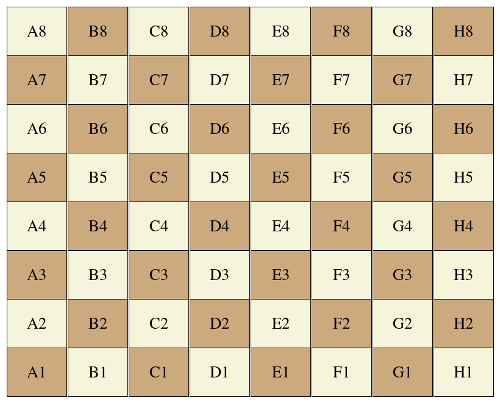
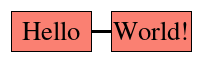
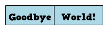
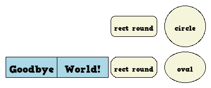
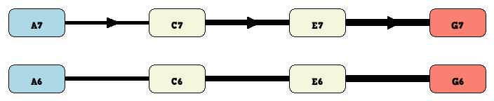
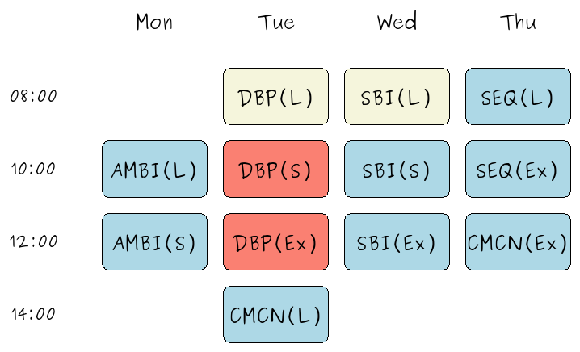
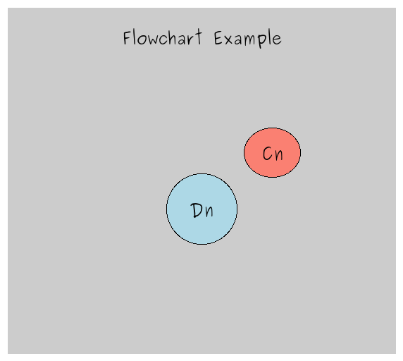
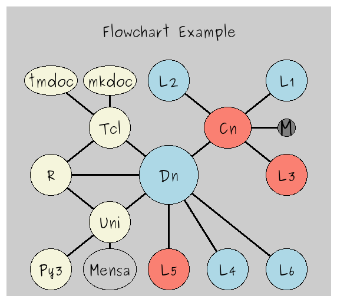
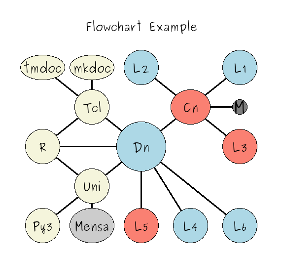

---
## YAML START
###  Created By    : Dr. Detlef Groth
###  Created       : Sun Nov 15 17:03:56 2020
####  Last Modified : <201203.0548>
title: "Intro to the chesschart package"
shorttitle: "chesschart intro"
author: 
- Dr. Detlef Groth
date: 2020-12-03
abstract: >
    The chesschart package is a snit widget based on the canvas command which can be used
    to create flowchart with an easy to use coordinate system, like the chessboard coordinates.
    In this introduction the most common features of the chesschart package
    will be shown to the user. 
    
output: 
  pdf_document:
      extra_dependencies: ["flafter"]
  html_document:  
    toc: true
    toc_depth: 3
    theme: united
documentclass: scrartcl
geometry:
- top=20mm
- bottom=25mm
- left=20mm
- right=20mm
vignette: >
  %\VignetteEngine{knitr::rmarkdown}
  %\VignetteIndexEntry{pkgname}
  %\usepackage[utf8]{inputenc}
## YAML END
---

## Introduction

The chesschart package allows fast creation of flowcharts using the standard
Tk canvas widget where commands are added using a snit widget wrapper to to
add rectangles, ovals, circles as well as arrows and lines connecting them to
the canvas using an easy to remember coordinates like the chessboard one. The
developer can supply as well their own coordinate system for instance a
Weekday:Hour like system to implement a timing schema. It is as well possible
to embed flowcharts into standard documentations like Markdown based ones. For
instance this tutorial here is written using the `tmdoc` and the `canvas::snap`
packages where the flowcharts as saved as png files.


## Example 0 - The Coordinate System

Let's in this initial example load the package and pack a chesschart widget
into our main toplevel, thereafter we add code to show the coordinate system.
Here the default chessboard coordinate system is used:


```{.tcl}
package require chesschart
pack [frame .main -background white] -side top -fill both -expand yes -padx 5 -pady 5
pack [chesschart .c -background white] -side top -fill both -expand true
set chart .c
set cols [join [join [lrepeat 4 [lrepeat 4 [list burlywood3 beige]] \
    [lrepeat 4 [list beige burlywood3]]]]]
set x -1
foreach row [list 1 2 3 4 5 6 7 8] {
        foreach col [list A B C D E F G H] {
       $chart rect $col$row -width 98 -height 80 -text $col$row \
        -color [lindex $cols [incr x]]
    }
}
```




Please note, that each rectangle has the tags *rect* and the coordinate like
*E4*, the text on the rectangle has the tags *text* and as well the coordinate
where it is placed. using the tags all standard canvas commands can be applied
on the items tagged with those tags. BTW, if you would like to draw a real
chessboard, you would have to modify the widget options for *-xincr* (default:
100) and *-yincr* (default: 80) so that they have the same value. Then
obviously as well the the rectangle has to be a square and not a rectangle
with different values for lenght and width.


## Example 1 - Hello World


Let's start with the typical "Hello World example". Before however, we just
delete our items which were placed in the example above on the widget to demonstrate the coordinate system.


```{.tcl}
$chart delete all
$chart rect A7 -text "Hello"
$chart rect B7 -text "World!"
$chart line A7 B7
```




Note, that a line hast the canvas tags *line* and the coordinates *fromto*
here *A7B7*. Again, you can use those tags to move, modify or erase those elements using
standard canvas commands.


## Example 2 - Changing the Font

As Tk and the canvas widget supports truetype and opentype fonts, we can as well easily change the default font. 
I downloaded and installed here the free font _HVD Comic Serif Pro_ from the dafont website: 
[https://www.dafont.com/hvd-comic-serif.font](https://www.dafont.com/hvd-comic-serif.font)
and installed it into my system. This is an OTF-font but truetype fonts would work as well, 
You can take however any font which is already on your system. Below you find code to modify existing text items using the canvas *itemconfigure* command or all newly created text items using the *configure* command of the *chesschart* widget.

```{.tcl}
foreach size [list 8 10 12 14 16 18 20 24 28] {
       font create hvd$size -family "HVD Comic Serif Pro" -size $size
}
 # configure the existing items
$chart itemconfigure text -font hvd14

$chart delete all
 # configure new items
$chart configure -font hvd12
 # We now add two additional item with 
 # -width 100 this is the principial grid width.
$chart rect A6 -text Goodbye -width 100 -color "light blue" 
$chart rect B6 -text World! -width 100 -color "light blue" 
```



## Example 3 - Flowchart shapes

There are as well other shapes available. We can give to the rectangle a flag
`-round true` to create rounded rectangle.

```{.tcl}
$chart configure -font hvd8
$chart rect C7 -text "rect round" -width 90 -color beige -round true
$chart rect C6 -text "rect round" -width 90 -color beige -round true -radius 20
$chart oval D7 -text "circle" -width 80 -height 80 -color beige 
$chart oval D6 -text "oval" -width 80 -height 60 -color beige 
```




## Example 4 - Lines and Arrows

Let's again clean up the canvas, then we create a flow chart from left to
right, Arrows are made using the arrow command with two coordinates, the
starting coordinate and the end coordinate:

```{.tcl}
$chart delete all
$chart rect A7 -round true -color "light blue"
$chart rect C7 -round true -color beige
$chart rect E7 -round true -color beige
$chart rect G7 -round true -color salmon
$chart arrow A7 C7 -width 5
$chart arrow C7 E7 -width 8
$chart arrow E7 G7 -width 10
$chart rect A6 -round true -color "light blue"
$chart rect C6 -round true -color beige
$chart rect E6 -round true -color beige
$chart rect G6 -round true -color salmon
$chart line A6 C6 -width 6
$chart line C6 E6 -width 8
$chart line E6 G6 -width 10
puts [$chart bbox all]
```




## Example 5 - Splines

We can as well add splines, currently arrow for splines are not supported. You
have to add three coordinates for the spline. 

```{.tcl}
$chart spline A6 B4 C6 -color "grey50" -width 5
$chart spline C6 D4 E6 -color "grey50" -width 8
$chart spline E6 F4 G6 -color "grey50" -width 10

```


## Example 6 - Other Coordinate System

For some situations it might be not appropiate to use a chessboard coordinate
system. Here we modify our coordinate system to create a weekly planer. We
further use the true type font Purisa which can be downloaded for free from
[https://www.onlinewebfonts.com/fonts/purisa](https://www.onlinewebfonts.com/fonts/purisa).
As this font fits nicely with flowcharts the font sizes are already defined if
this font is available on your system. If you know an other nice font which
has a MIT-like license and could be included directly within the package, let me know. The contact address you find below.


```{.tcl}
$chart delete all
$chart configure -rows [list 06 08 10 12 14] \
    -columns [list NN Mo Tu We Th Fr Sa So] \
    -font purisa14
$chart configure -rectwidth 130 -rectheight 70
$chart configure -xincr 150 -yincr 90
;# now we setup rows and columns
$chart text NN08 08:00
$chart text NN10 10:00
$chart text NN12 12:00
$chart text NN14 14:00
$chart text Mo06 Mon 
$chart text Tu06 Tue
$chart text We06 Wed
$chart text Th06 Thu
;# next we can fill the canvas with our weekly events
$chart rect Mo10 -text AMBI(L) -color "light blue" -round true
$chart rect Mo12 -text AMBI(S) -color "light blue" -round true

$chart rect Tu08 -text DBP(L)  -color "beige" -round true
$chart rect Tu10 -text DBP(S)  -color "salmon" -round true
$chart rect Tu12 -text DBP(Ex) -color "salmon" -round true
$chart rect Tu14 -text CMCN(L) -color "light blue" -round true

$chart rect We08 -text SBI(L)  -color "beige" -round true
$chart rect We10 -text SBI(S)  -color "light blue" -round true
$chart rect We12 -text SBI(Ex) -color "light blue" -round true
$chart rect Th08 -text SEQ(L)  -color "light blue" -round true
$chart rect Th10 -text SEQ(Ex) -color "light blue" -round true
$chart rect Th12 -text CMCN(Ex) -color "light blue" -round true
```




## Example 7 - canvas::snap with constant figure sizes

The graphics here are generated using the *canvas::snap* package which selects
the snap area based on the bounding box for all items on the canvas. To avoid
different sizes for your canvas snaps you can start with a background.
Let's set back our coordinate system to a chessboard one:

```{.tcl}
$chart delete all
$chart configure -rows [list B C D E F] \
    -columns [list 2 3 4 5 6]
$chart background B7 F2 -color grey80
$chart text D7 "Flowchart Example"

$chart oval D4 -width 100 -height 100 -text Dn -color "light blue"
$chart oval E5 -width 80 -height 70 -text Cn
```
```{.tclout}
169 121 867 537
```



Therafter we can add again our elements.

```{.tcl}
$chart oval F6 -width 70 -height 70 -text L1 -color "light blue"
$chart oval D6 -width 70 -height 70 -text L2 -color "light blue"
$chart configure -font purisa18
$chart oval F5 -width 30 -height 30 -text M -color "grey50"
$chart configure -font purisa14
$chart oval F4 -width 70 -height 70 -text L3 -color "salmon"
$chart oval F2 -width 70 -height 70 -text L6 -color "light blue"
$chart oval E2 -width 70 -height 70 -text L4 -color "light blue"
$chart oval D2 -width 70 -height 70 -text L5 -color "salmon"
$chart oval C3 -width 70 -height 70 -text Uni -color "beige"
$chart oval C5 -width 70 -height 70 -text Tcl -color "beige"
$chart oval B4 -width 70 -height 70 -text R -color "beige"
$chart oval B2 -width 70 -height 70 -text Py3 -color "beige"
$chart configure -font purisa14
$chart oval C6 -width 90 -height 50 -text mkdoc -color "beige"
$chart oval B6 -width 90 -height 50 -text tmdoc -color "beige"
$chart oval C2 -width 90 -height 70 -text Mensa -color "grey80"
foreach {f t} {
    D4 E5 D4 F2 D4 E2 D4 D2 D4 C3 D4 B4 D4 C5  
    E5 F6 E5 F5 E5 D6 E5 F4 
    C5 B4 C5 B6 C5 C6
    C3 B2 C3 B4 C3 C2} {
    $chart line $f $t   
}
```




As the chesschart widget is inheriting from the canvas widget, we can configure all canvas items using standard canvas commands.

Let's now change the background to white using a standard canvas command:

```{.tcl}
$chart itemconfigure background -fill white -outline white
```




Voila!

## Future ideas

* arrows and lines which can have specific shapes, like below the B3B7 line

```
    B7 -+
        |
    B5  |
    |   |
    B3 -+ 

```

* arrows which end at the next node, not in the middle
* more tests on vertical text which is available in Tk 8.6

## Session Info


 
This document was generated using 
Tcl/Tk 8.6.8 on 
Linux, 5.8.18-100.fc31.x86_64
with tmdoc:tmdoc 0.4.


## Links

* project homepage [https://github.com/mittelmark/DGTcl](https://github.com/mittelmark/DGTcl)
* wiki page [https://wiki.tcl-lang.org/page/chesschart](https://wiki.tcl-lang.org/page/chesschart)
* video tutorial with some background [https://www.youtube.com/watch?v=lfIPM5eyuVA](https://www.youtube.com/watch?v=lfIPM5eyuVA)

## Copyright

Copyright @ 2020 Detlef Groth, Germany (detlef - {at} - dgroth - {dot} - de)
