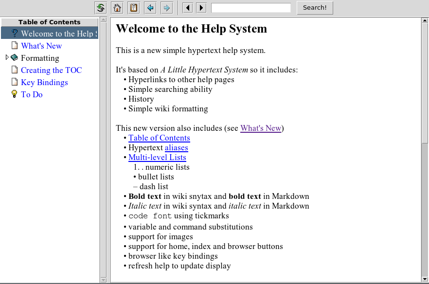

## <a name="toc">Table of Contents</a>

  * [Table of Contents](#toc)
  * [Home](#home)
  * [Sections](#sections)
  * [List examples](#lists)
  * [Emphasis examples](#emph)
  * [Code examples](#code)
  * [Indentation examples](#indent)
  * Images and Links
     * [Images](#images)
     * [Links](#links)
  * [Summary](#summary)

-----

## <a name="home">Home</a>

In the following the Markdown markup subset is described which can be used to
create from the same source, both the help page, as well as valid Markdown
very close to the help page. Sometimes it is nessessary to avoid direct
interpretation of the markup to put a dot in front of the source code which
should be removed during writing.

-----

## <a name="section">Sections</a>

Sections or pages are created after a line starting with 5 hyphens and an
empty line. Thereafter the title of the page and an alias should be set using
standard html/Markdown code like shown here:
    
    -----
    
    ## <a name="section">Sections</a>

Is the header for this page. Please note, that four, and only four(!) hyphens will be used to display a horizontal text line in the hyperhelp viewer.

So:

   ----
   
produces:

----

5 hyphens are used to separate the different pages from each other.

-----

## <a name="lists">List examples</a>

Here is the code for a nested unumbered list (leading dots should be ignored):

    .* list item 1
    .* list item 2
    .* list item 3
    .  * subitem 3.1
    .* list item 4
    .* ...
 
This results in the folling list:

  * list item 1
  * list item 2
  * list item 3
    * subitem 3.1
  * list item 4
    * subitem 4.1
    * subitem 4.2
  * list item 5

Also numbered lists are possible, but the nesting is not cross compatible between Help and Markdown mode.  

  1. numbered item 1
  2. numbered item 2
  3. numbered item 3  
  4. numbered item 4  

-----

## <a name="emph">Emphasis examples</a>

The code:

     Let's write mixed **bold** and *italic* and `typewriter text` in one line.

Produces:

Let's write mixed **bold** and *italic* and `typewriter text` in one lines.

-----

## <a name="indent">Indentation examples</a>

### Paragraph indentation

Paragraph indentation is done using the greater sign as shown below:

   .> text, indentation continues up to the next empty line.
   
Here an example:

> Lorem ipsum dolor sit amet consectetur adipiscing elit sollicitudin, odio 
varius nam ridiculus taciti penatibus risus vivamus, 
dignissim vestibulum luctus mus arcu lectus donec. Fermentum maecenas taciti purus netus posuere, 
nam morbi quam porttitor congue, habitasse vulputate faucibus dis. Vel gravida mattis aliquet 
sagittis taciti porttitor ullamcorper dapibus tortor pulvinar platea lobortis, 
lacus a placerat proin erat per ornare iaculis eleifend netus.

> *Hendrerit morbi egestas cras rhoncus pellentesque diam sociosqu aptent, 
netus tellus interdum odio per ultricies luctus nostra, varius arcu sem 
tempor facilisi et molestie. Orci augue fermentum sagittis conubia accumsan 
ad congue convallis, enim nibh aliquam nostra mi iaculis ultricies laoreet gravida, 
mollis auctor quisque feugiat morbi platea leo. Massa sociosqu tempor nisl hendrerit 
sociis suscipit ligula pellentesque, sapien ultrices commodo sollicitudin faucibus 
placerat diam, a porta vivamus in phasellus eget erat.*

### List indentation

Is as well possible if the first list element is prefixed with a greater sign
like here - the dot just inhibts interpretation as list:

        . > - list item 1 indented
        .   - list item 2 indented 
        .   - list item 3 indented 

Produces this:

> - list item 1 indented
  - list item 2 indented 
  - list item 3 indented 

-----

## <a name="code">Code examples</a>

Source code blocks are done using at least three whitespaces at the beginning
of the lines.

Here is a short code example:

    if {$x == 1} {
       puts "x is 1"
    }

A special problem are code lines starting with hyphens, plus or star symbols.
Currently you should preceed those lines with a dot character as before the
actual symbol itself.

    .* indented list as source code
    .* second item
      
-----

## <a name="images">Images</a>

Images can be inlined using standard Markdown syntax like here:

    . 
    

-----

## <a name="links">Links</a>

Only links to internal pages are supported:

    . [Table of Contents](#toc)(#toc)

  * [Table of Contents](#toc)
  * [Summary](#summary)

-----

## <a name="summary">Summary</a>

As those examples show, with the basic set of Markdown commands we can
create documents which can be used at the same time as help pages for the
hyperhelp viewer. As we have valid Markdown, this document can be given into
other tools, for instance pandoc, to produce html or even pdf documents.

