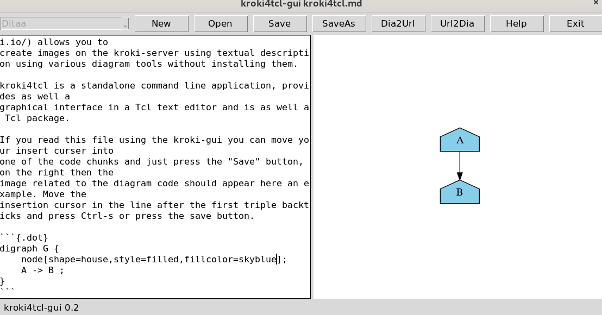

## kroki4tcl - README

The HTML version of this README is here: [README.html](https://htmlpreview.github.io/?https://github.com/mittelmark/DGTcl/blob/master/lib/kroki4tcl/README.html)

[Kroki](https://kroki.io/) is a webservice provides a unified API with support for BlockDiag
(BlockDiag, SeqDiag, ActDiag, NwDiag, PacketDiag, RackDiag), BPMN, Bytefield,
C4 (with PlantUML), Ditaa, Erd, Excalidraw, GraphViz, Mermaid, Nomnoml,
Pikchr, PlantUML, SvgBob and other diagram tools. 

*kroki4tcl* is Tcl package which provides facilities to convert diagram code
into URL's which can be embedded into any website or Markdown document. The
package further has a graphical user interface where you can edit single
diagram files or Markdown files containing multiple code chunks for the
diagram tools which can be edited and previewed. And lastly *kroki4tcl* can be
used as terminal application to convert diagram code saved to files to images.

## Usage

### Package

Two main functions can be used:

* **kroki4tcl::dia2kroki** *diagramtext ?diatype? ?fileformat?*

Convert a diagram text to an embeddedable URL.

> - diagramtext - the diagram text
  - diatype - the diagram type such as graphviz, ditaa, svgbob etc, default: graphviz
  - fileformat - the requested file format such as svg, png or pdf, default: svg
  
> Example:

> ```{.tcl}
  source kroki4tcl.tcl
  set url [kroki4tcl::dia2kroki "
  +-----------+    +-----------+
  |    cFCE   |    |   cCFE    |    
  |   Hello   |--->|   World!  |
  |           |    |           |
  +-----------+    +-----------+
  " ditaa png]
  puts $url
>  ```

> This URL can be embedded into any webpage. Here is the resulting image.

> 

* **kroki4tcl::kroki2dia** *url*

> Convert a given URL back to diagram text.

> - url - a kroki URL

> Example:

> ```{.tcl}
 puts [::kroki4tcl::kroki2dia https://kroki.io//ditaa/png/eJzj0tZFAG0FIEAR4KoBCSW7ObsCKTAbRCQ7u7nC2ApgJR6pOTn5IBGgJjuQQHh-UU6KIlAAYgIUwE2AC3ARsB8A0f4exQ]
> ```

### GUI

You can start the graphical user interface using the --gui command line
argument. The GUI application needs an installed wget to download the images
from the server. The application allows you to edit single diagrams in one
source code file or multiple graphics embedded within code chunks of a
Markdown document. To check this out, just use the help file using the help
button in the upper right. Place the cursor in a code chunk and press Ctrl-s
to save the file. In the label widget on the right the current diagram code
will be translated to an image. See below for an example:



### Command line application


Usage (conversion): `kroki4tcl.tcl infile outfile` 

Usage (URL): `kroki4tcl.tcl infile` (shows the kroki URL on the terminal

Possible input file extensions are:  

-  adia ([ActDiag](http://blockdiag.com/en/)) 
-  bdia ([BlockDiag](http://blockdiag.com/en/)) 
-  ditaa ([Ditaa](http://ditaa.sourceforge.net/)) 
-  dot ([GraphViz](https://www.graphviz.org/)) 
-  erd ([ERD](https://github.com/BurntSushi/erd)) 
-  mmd ([Mermaid](https://mermaid-js.github.io/mermaid/#/)) 
-  nml ([Nomnoml](https://www.nomnoml.com/)) 
-  ndia ([NwDiag](http://blockdiag.com/en/)) 
-  pik ([Pikchr](https://pikchr.org/home/doc/trunk/homepage.md)) 
-  puml ([PlantUML](https://github.com/plantuml/plantuml)) 
-  sbob ([Svgbob](https://ivanceras.github.io/svgbob-editor/))
-  sdia ([SeqDiag](http://blockdiag.com/en/))

Possible output file extensions are: svg, png or pdf, the latter two might
require an installation of the `cairosvg` package which can be achieved on
Unix platforms like this `pip3 install cairosvg --user`.. 

## ChangeLog

- 2022-02-23 - first version 0.2.0
- 2022-02-25 - 0.3.0 some fixes for Markdown mode

## License

MIT


