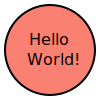
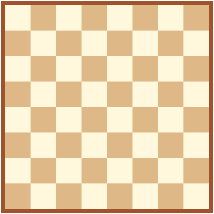
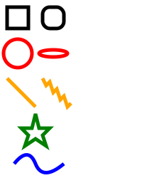
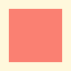

## NAME

_pandoc-tcl-filter.tcl_ - filter to execute code within Markdown documents and use code results for documentation.

## USAGE

```
pandoc input.md -s -o output.html --filter pandoc-tcl-filter.tcl
```

## Installation

The filter can be installed locally by placing it in a folder belonging to
your personal PATH and making the file executable or alternatively you can
just use it by specifying the correct path to the Tcl script in your pandoc
command line call. The direct link to the github repository folder is:
[https://downgit.github.io/#/home?url=https://github.com/mittelmark/DGTcl/tree/master/pandoc-tcl-filter](https://downgit.github.io/#/home?url=https://github.com/mittelmark/DGTcl/tree/master/pandoc-tcl-filter)
Just unpack the Tcl script from the download and make the file executable.

The filter requires the Tcl package *rl_json* which is available from Github: [https://github.com/RubyLane/rl_json](https://github.com/RubyLane/rl_json).
Unix users should be able to install the package via the standard configure/make pipeline. A Linux binary, complied on a recent Fedora system is included in the download
link at the GitHub page as well to simplify the use of the Pandoc filter.
Windows users should install the rl_json package via the Magicplats Tcl-Installer: [https://www.magicsplat.com/tcl-installer](https://www.magicsplat.com/tcl-installer/index.html)

## Example

The HTML version of this file can be seen on [GitHub](https://htmlpreview.github.io/?https://github.com/mittelmark/DGTcl/blob/master/pandoc-tcl-filter/Readme.html).

Tcl code can be embedded either within single backtick marks where the first
backtick is immediately followed by the string tcl and the the tcl code such
as in the following example:
 
```
The variable is now `tcl set x 5` or five times three is `tcl expr {3*5}`.

This document was processed using Tcl `tcl package provide Tcl`.

```

Here the output:

The variable is now `tcl set x 5` or five times three is `tcl expr {3*5}`.

This document was processed using Tcl `tcl package provide Tcl`.


The results from the code execution will be directly embedded in the text and will replace the Tcl code.
Such inline statements should be short and concise and should not break over
several lines.

Larger chunks of code can be placed within triple backticks such as in the example below.

```
` ``{.tcl}
 # please remove the space after the first backtick above
 set x 3
 proc add {x y} {
       return [expr {$x+$y}]
 }
 add $x 7
 # please remove the space after the first backtick below
` ``
```

In the code above a space was added to avoid confusing the pandoc interpreter
by nesteding triple tickmarks, remove those spaces in your code.

And here the output:

```{.tcl}
set x 3
proc add {x y} {
    return [expr {$x+$y}]
}
add $x 7
```

Please note, that only the last statement is shown in code block after the Tcl
code. To show more output you can use the `puts` command.

Within the curly braces the following attributes are currently supported:

* _eval=false|true_ - evaluate the Tcl code
* _results=show|hide_ - show the output of the Tcl code execution
* _echo=true|false_ - show the Tcl code

Errors in the tcl code will be usually trapped and the error info is shown
instead of the regular output.

## Images

As Tcl has no standard library in the core to create graphics without the Tk
toolkit we will create a small object using a minimal object oriented system
which can create svg files easily.

```{.tcl}
;# the onliner OO system thingy see here
;# https://wiki.tcl-lang.org/page/Thingy%3A+a+one%2Dliner+OO+system
proc thingy name {
    proc $name args "namespace eval $name \$args"
} 
;# our object
thingy svg

;# some variables
svg set code "" ;# the svg code
svg set header {<?xml version="1.0" encoding="utf-8" standalone="yes"?>
    <svg version="1.1" xmlns="http://www.w3.org/2000/svg" height="__HEIGHT__" width="__WIDTH__">}    
svg set footer {</svg>}
svg set width 100
svg set height 100

;# lets look what variables are there
info vars svg::* 
```


We now need a method _unknow_ which catches all command on the object and
forward this to the tag creation method.

```{.tcl}
;# the actual tag svg creation method
svg proc tag {args} {
    variable code
    set tag [lindex $args 0]
    set args [lrange $args 1 end]
    set ret "\n<$tag"
    foreach {key val} $args {
        if {$val eq ""} {
            append ret ">\n$key\n</$tag>\n"
            break
        } else {
            append ret " $key=\"$val\""
        }
    }
    if {$val ne ""} {
        append ret " />\n"
    }
    append code $ret
}

; # any unknown should forward to the tag method
namespace eval svg {
    namespace unknown svg::tag
}

; # write out the current svg code 
svg proc write {filename} {
    variable width
    variable height
    variable header
    variable footer
    variable code
    set out [open $filename w 0600]
    set head [regsub {__HEIGHT__} $header $height]
    set head [regsub {__WIDTH__} $head $width]
    puts $out $head
    puts $out $code
    puts $out $footer
    close $out
}

;# what methods we have
info commands svg::*
```

Ok we are now ready to go: Let's create the typical "Hello World!" example,
the first argument will be the tag every remaining pairs will be the attribute
and the value, remaining single arguments will be placed within the tag as
content:

```{.tcl}
svg circle cx 50 cy 50 r 45 stroke black stroke-width 2 fill salmon
svg text x 29 y 45 Hello
svg text x 27 y 65 World!
svg write hello-world.svg
```

Let's now display the image:

```
 
``` 

Here the image displayed:


Let's now clean up the svg code:
```{.tcl}
svg set code ""
svg set code 
```

We can now create an other image, let's create a chessboard:

```{.tcl}
svg set width 420
svg set height 420
for {set i 0} {$i < 8} {incr i} {
    if {[expr {$i % 2}] == 0} {
        set cols [join [lrepeat 4 [list cornsilk burlywood]]]
    } else {
        set cols [join [lrepeat 4 [list burlywood cornsilk ]]]
    }   
    for {set j 0} {$j < 8} {incr j} {
        set x [expr {10+$i*50}]
        set y [expr {10+$j*50}]
        svg rect x $x y $y width 50 height 50 fill [lindex $cols $j] stroke-width 3
    }
    svg rect x 6 y 6 width 408 height 408 stroke sienna stroke-width 7 fill transparent
}   
svg write chessboard.svg
```




Great! Let's now illustrate a few more basic shapes. We will follow the examples at [https://developer.mozilla.org/en-US/docs/Web/SVG/Tutorial/Basic_Shapes](https://developer.mozilla.org/en-US/docs/Web/SVG/Tutorial/Basic_Shapes)

But first let's rewrite the `svg tag` function so that we can as well take a list of attributes.

```{.tcl}
svg proc tag {args} {
    variable code
    set tag [lindex $args 0]
    set args [lrange $args 1 end]
    set ret "\n<$tag"
    # new check if attr="val" syntax  
    if {[regexp {=} [lindex $args 0]]} {
        set nargs [list]
        foreach kval $args {
            set idx [string first = $kval]
            set key [string range $kval 0 $idx-1]
            set val [string range $kval $idx+2 end-1]
            lappend nargs $key
            lappend nargs $val
        }
        set args $nargs
    } 
    # end of new check
    foreach {key val} $args {
       if {$val eq ""} {
           append ret ">\n$key\n</$tag>\n"
           break
       } else {
           append ret " $key=\"$val\""
       }
    }
    if {$val ne ""} {
        append ret " />\n"
    }
    append code $ret
}
```

With this redefinition of the tag method we can now very easily copy the svg
code from the website. We just have to remove the greater, smaller and slash
tag signs from the svg code. As arguments to functions in Tcl are separated by
spaces we have to protect attributes containing spaces with curly braces for
the last three shapes, the polyline, the polygon and the path.

```{.tcl}
svg set code "" ;# cleanup chessboard
svg set width 200 ;# new size as on the webpage
svg set height 250 
svg rect x="10" y="10" width="30" height="30" stroke="black" fill="transparent" stroke-width="5"
svg rect x="60" y="10" rx="10" ry="10" width="30" height="30" stroke="black" fill="transparent" stroke-width="5"
svg circle cx="25" cy="75" r="20" stroke="red" fill="transparent" stroke-width="5"
svg ellipse cx="75" cy="75" rx="20" ry="5" stroke="red" fill="transparent" stroke-width="5"
svg line x1="10" x2="50" y1="110" y2="150" stroke="orange" stroke-width="5"
svg polyline {points="60 110 65 120 70 115 75 130 80 125 85 140 90 135 95 150 100 145"} \
     stroke="orange" fill="transparent" stroke-width="5"
svg polygon {points="50 160 55 180 70 180 60 190 65 205 50 195 35 205 40 190 30 180 45 180"} \
     stroke="green" fill="transparent" stroke-width="5"
svg path {d="M20,230 Q40,205 50,230 T90,230"} fill="none" stroke="blue" stroke-width="5"
svg write basic-shapes.svg
```



Ok, great basic shapes can be directly copied from svg code and with a few
modifications we can create valid Tcl code out of the svg code. 
Please note, that from the code shown in this Readme the package _tsvg_ was derived which
does not need this protecting of the spaces within the attributes. See below the section
about the _tsvg_ plugin for more details.

## Code chunk attributes for figures

Let's introduce now a few code chunk attributes for figures as they are known for instance in R.

Below an example:
```
    ```{.tcl fig=true fig.width=400 fig.height=400}
    # some figure code
    ```
```

This code should call some procedure figure with the arguments of a basic filename, fig.width, fig.height and it should return a filename with an extension like `.svg`

Here an outline of such a function:

```
proc figure {filename width height args} {
    # parse args, get width, get height
    # write file
    # return filename with extension
}
```
Ok, lets now implement our figure procedure for our svg:

```{.tcl} 
proc figure {filename width height args} {
    svg set width $width
    svg set height $height
    svg write $filename.svg
    return $filename.svg
}
```

Now in the next code chunk we create a new figure:

```
   ` ``{.tcl label=figsample fig=true width=80 height=80}
   svg set code ""
   svg rect x 0 y 0 width 80 height 80 fill cornsilk
   svg rect x 10 y 10 width 60 height 60 fill salmon
   ` ``
   
   
```   

Here the actual code (the space between the backticks was added to avoid
interpretation problems by pandoc):

```{.tcl label=figsample fig=true width=80 height=80}
svg set code ""
svg rect x 0 y 0 width 80 height 80 fill cornsilk
svg rect x 10 y 10 width 60 height 60 fill salmon
```


* TODO: autoembedding of figures by chunk number

## Other filters than Tcl code filter

Let's finish our small tutorial with the implementation of a filter for a
command line application. Below you see the code for the GraphViz dot application.

Here the code example:

```
` ``{.dot label=digraph echo=true}
digraph G {
  main -> parse -> execute;
  main -> init;
  main -> cleanup;
  execute -> make_string;
  execute -> printf
  init -> make_string;
  main -> printf;
  execute -> compare;
}
` ``
```

Which will produce the following output:

```{.dot label=digraph echo=true}
digraph G {
  main -> parse -> execute;
  main -> init;
  main -> cleanup;
  execute -> make_string;
  execute -> printf
  init -> make_string;
  main -> printf;
  execute -> compare;
}
```

Using the chunk option echo=false, we can as well hide the source code. 
If you would like to see the code you now have to consult the Markdown file.


```{.dot label=digraph2 echo=false}
digraph G {
  main [shape=box,style=filled,fillcolor=".5 .8 1.0"] ;
  main -> parse -> execute;
  main -> init [style=dotted];
  main -> cleanup;
  execute -> make_string;
  execute -> printf
  edge [color="red"];
  init -> make_string;
  main -> printf;
  execute -> compare;
}
```

To avoid automatic placement of figures you can as well set the option include
to false _include=false_ and then create the usual Markdown code for the figure
where the basename is defined by the chunk label.

```
` ``{.dot label=digraph3 echo=false include=false}
digraph G {
  main [shape=box,style=filled,fillcolor=".5 .8 1.0"] ;
  main -> parse -> execute;
  main -> init [style=dotted];
  main -> cleanup;
  execute -> make_string;
  execute -> printf
  edge [color="red"];
  init -> make_string;
  main -> printf;
  execute -> compare;
}
` ``

```

This will produce the following:

```{.dot label=digraph3 echo=false include=false}
digraph G {
  main [shape=box,style=filled,fillcolor="0.95 0.90 .90"] ;
  main -> parse -> execute;
  main -> init [style=dotted];
  main -> cleanup;
  execute -> make_string;
  execute -> printf
  edge [color="red"];
  init -> make_string;
  main -> printf;
  execute -> compare;
}
```


Ok, now you know what was the code to create the graphic above.

## tsvg plugin

The code shown above creating svg files using the thingy object was as well
saved as a plugin with some modifications and extensions. 
That way you can include code creating svg files using the described syntax above. 
Please not that the plugin object is named `tsvg`. Here an example.

```
 ` ``{.tsvg label=tsvg-hello-world results=hide echo=false}
 tsvg circle cx 50 cy 50 r 45 stroke black stroke-width 2 fill salmon
 tsvg text x 29 y 45 Hello
 tsvg text x 26 y 65 World!
 ` ```
```

Will produce this:

```{.tsvg label=tsvg-hello-world results=hide echo=true}
tsvg circle cx 50 cy 50 r 45 stroke black stroke-width 2 fill salmon
tsvg text x 29 y 45 Hello
tsvg text x 26 y 65 World!
```


In contrast to the svg code developed above the _tsvg_ plugin allows you to 
send the attributes containing as well spaces as they are, the _tag_ method will clean up 
the lists arguments by using the paired quotes. Thsi greatly simplifies the
copy and paste procedure for existing svg examples, you in many cases just have to remove
the leading and trailing greater and lower signs.
Here is an example using different syntax types:

```{.tsvg label=tsvg-polyline results=hide echo=true}
tsvg set code ""
tsvg set width 180
tsvg set height 200
tsvg rect x 10 y 10 width 160 height 180 style "fill:#ddeeff;"
tsvg circle cx="130" cy="120" r="20" stroke="red" stroke-width="2" fill="salmon"
tsvg polyline points="0,40 40,40 40,80 80,80 80,120 120,120 120,160" \
   style="fill:white;stroke:red;stroke-width:4"
```  

For more information about the _tsvg_ package visit the [tsvg manual page](lib/tsvg/tsvg.html).

## Summary

In this tutorial I explained on how to use the Tcl pandoc filter to embed and
process  Tcl code during the creation of HTML or PDF documents. The Tcl filter
was generalized so that as well filters for other tools, especially 
command line application can be easily programmed using the Tcl programming
language. Examples for a filter for the GraphViz tool dot to create flowcharts and graphs
and a package to create SVG images using Tcl, the new _tsvg_ package, were as well
given. The provided infrastructure has the advantage that Tcl programmers can stay
within their favourite programming language but still can use other nice tools easily for
their documentation. 

## Documentation

The HTML version of this document was generated using the following commandline:

```
pandoc Readme.md --metadata title="Readme pandoc-tcl-filter.tcl" \
    -M date="`date "+%B %e, %Y %H:%M"`" -s -o Readme.html \
     --filter pandoc-tcl-filter.tcl --css mini.css

```

Please look at the source Markdown file to see which Markdown code was the input.

## Links

* [DGTcl homepage at GitHub](https://github.com/mittelmark/DGTcl)
* [Discussion page for pandoc-tcl-filter.tcl on the Tclers Wiki](https://wiki.tcl-lang.org/page/pandoc%2Dtcl%2Dfilter) 
* [Documentation to the tsvg package](http://htmlpreview.github.io/?https://github.com/mittelmark/DGTcl/blob/master/pandoc-tcl-filter/lib/tsvg/tsvg.html)
* [https://pandoc.org/filters.html](https://pandoc.org/filters.html) - background on  pandoc filters
* [pandoc lua filters](https://github.com/pandoc/lua-filters)
* [https://github.com/mvhenderson/pandoc-filter-node](https://github.com/mvhenderson/pandoc-filter-node) - pandoc filters using JavaScript and TypeScript
* [https://pypi.org/project/panflute/](https://pypi.org/project/panflute/) - pandoc filters in Python
* 

## Todo

* code block labels (label=chunkname)  - done
* code block figures (include=false fig=true) - done
* regular filter infrastructure for Tcl support for for instance other filters like .csv to include csv files .dot to include dot file graphics etc. - done (examples for dot code and tsvg plugin)
* Windows exe / starkit containing the rl_json library as well (adding linux library)

## History

* 2021-08-22 - Release of Wiki cocde
* 2021-08-25 - Release of github code
* 2021-08-26 - Adding thingy svg creator, image file writing works


## Author

Detlef Groth, Caputh-Schwielowsee, Germany

## License

MIT, see the file LICENSE in the release folder.
